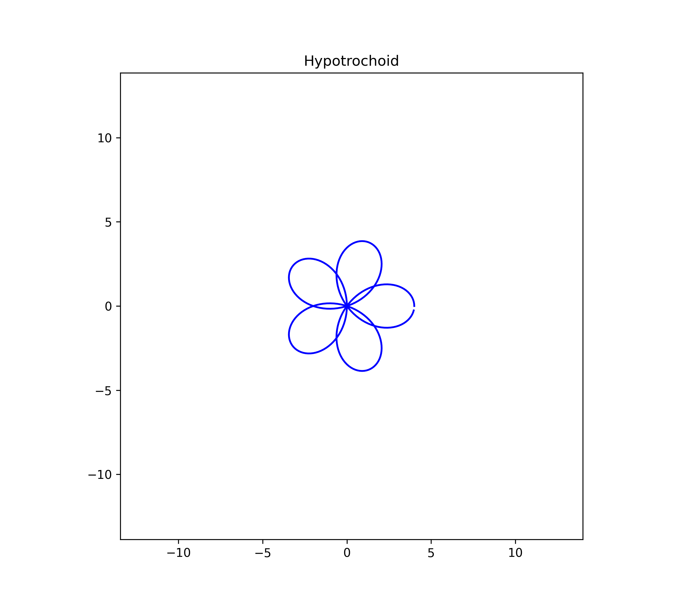

# 🌀 Spirograph Art Generator by Lerocko MZ

A fusion of **mathematics, art, and code** — this Python project generates intricate spirograph patterns inspired by the geometry of motion and creativity.  
Designed as both a **technical exploration** and an **artistic expression**, it transforms mathematical equations into mesmerizing digital visuals.

---

## ✨ Features

- 🎨 Generates custom spirograph patterns with user-defined parameters  
- 📈 Utilizes trigonometric functions to create smooth mathematical curves  
- 🧮 Combines geometry, motion, and art in a visual simulation  
- 💾 Allows saving of generated patterns as image files  
- ⚙️ Adjustable parameters for color, rotation, radius ratios, and density  
- 🧠 A perfect balance between coding logic and creative experimentation  

---

## 🧰 Tech Stack


---

## 🧩 Example Output

Here’s an example of a generated spirograph pattern:



> _"Mathematics is not just logic — it’s rhythm, color, and movement."_  
> — **Lerocko MZ**

---

## ⚡ How to Run

1. Clone the repository  
   ```bash
   git clone https://github.com/Lerocko/Spirograph.git
   cd Spirograph

2. Install dependencies
    pip install matplotlib numpy

3. Run the program
    python spirograph.py

4. Generate your own patterns and save them automatically as images.

---

## 🧠 About the Project

This project was born from the intersection of geometry, physics, and artistic curiosity.
It explores the beauty of mathematical motion using parametric equations that describe circular paths — similar to those used in classic spirograph toys.

- The code was developed incrementally to:
- Strengthen Python and mathematical modeling skills
- Integrate data visualization with creative algorithms
- Produce unique, reproducible digital art

---

## 👨‍💻 Author

Lerocko MZ
📧 L.mz@outlook.com
🌐 GitHub Profile

---

## 🪶 License

This project is open-source under the MIT License.
Feel free to use, modify, and share with proper attribution.

---

